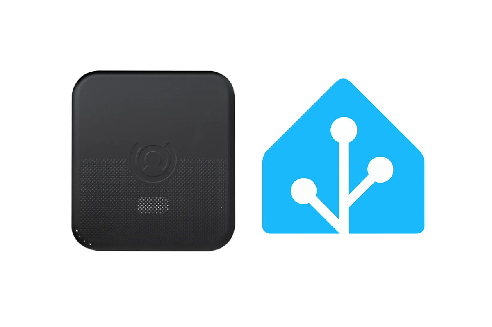

<div align="center">
  
  <br>
  <h1>🔒 Open iAlarm-MK</h1>
  <p><em>Home Assistant integration for iAlarm-MK alarm panels via local API</em></p>
  <br>
  <a href="https://pypi.org/project/open-ialarm-mk-local-api/"></a>
  <a href="https://github.com/VoidElle/hass-open-ialarm-mk/releases"></a>
  <a href="https://github.com/VoidElle/hass-open-ialarm-mk/blob/master/LICENSE"></a>
  <br>
  <a href="https://hacs.xyz"></a>
  <a href="https://www.home-assistant.io/"></a>
  <a href="https://github.com/VoidElle/hass-open-ialarm-mk"></a>
  <a href="https://github.com/VoidElle/hass-open-ialarm-mk/stargazers"></a>
  <a href="https://github.com/VoidElle/hass-open-ialarm-mk/commits"></a>
</div>


Open iAlarm-MK is a Home Assistant integration that enables local control and monitoring of **iAlarm-MK** alarm panels through Home Assistant.

Communicates **entirely over your local network** via direct TCP connection to the panel - no cloud, no P2P relay required.

> [!NOTE]
> Support has been confirmed on **MK7** panels. Other MK variants may work but have not been tested.
> For confirmed MK2 support, see [mistermax80/ialarm_mk2](https://github.com/mistermax80/ialarm_mk2).

## Installation 📦

### Via HACS (Recommended) ⭐

[](https://my.home-assistant.io/redirect/hacs_repository/?owner=VoidElle&repository=hass-open-ialarm-mk&category=integration)

### Via HACS (Manual)

1. Add custom repository:
    - Open HACS in your Home Assistant interface
    - Go to "Integrations" tab
    - Click on the three dots in the top right corner and select "Custom repositories"
    - Enter the repository URL: `https://github.com/VoidElle/hass-open-ialarm-mk`
    - Select "Integration" as the category
    - Click "Add"

2. Install the integration:
   - In HACS Integrations, click + Explore & Download Repositories
   - Search for "iAlarm-MK"
   - Click on the integration and then Download
   - Select the latest version and click Download

3. Restart Home Assistant 🔄

### Manual Installation 🔧

1. Copy `custom_components/open_ialarm_mk/` into your `config/custom_components/` directory
2. Restart Home Assistant

## Add the Integration to Home Assistant 🧩

After installing and restarting Home Assistant:

1. Go to **Settings -> Devices & Services**
2. Click **+ Add Integration**
3. Search for **"iAlarm-MK"**
4. Fill in the connection form

## Configuration ⚙️

All configuration is done through the Home Assistant UI - no `configuration.yaml` editing required.

| Field | Description | Default |
|---|---|---|
| **Host** | IP address of the panel | (required) |
| **Port** | TCP port | `8000` |
| **Username** | Panel login username | (required) |
| **Password** | Panel login password | (required) |
| **Poll interval** | How often to refresh state in seconds (10-300) | `30` |

The integration connects to the panel, retrieves the device MAC address as a unique identifier, and sets up all entities automatically.

To update credentials later, use **Reconfigure** from the integration page - no need to remove and re-add.

## Features ✨

- 🔒 **Alarm control panel** - arm away, arm home (stay), arm custom bypass (partial), disarm
- 🚨 **Cancel alarm button** - dedicated button to cancel an active alarm without fully disarming
- 🚪 **Zone binary sensors** - one sensor per configured zone with automatic device class detection
- 📡 **Fully local** - direct TCP connection to the panel, no internet required
- ⚡ **Real-time push events** - dedicated push TCP connection delivers alarm events instantly (triggered, armed, disarmed) without polling delay
- 🔄 **Configurable poll interval** - 10 to 300 seconds (polling used as fallback/confirmation)
- 🛠️ **Reconfigurable** - update host and credentials without removing the integration
- 🆔 **Unique ID** - panel MAC address prevents duplicate entries
- 🌍 **Localized error messages** - device rejection errors shown in your HA language

## Entities 🗂️

### Alarm Control Panel

| State | Description |
|---|---|
| `armed_away` | All zones active |
| `armed_home` | Stay / perimeter mode |
| `armed_custom_bypass` | Partial mode |
| `disarmed` | Panel disarmed |
| `triggered` | Alarm triggered |
| `arming` | Panel is arming |
| `unavailable` | Panel unreachable |

### Zone Binary Sensors

One entity per zone that is in use or has a name configured.

- **State** - `on` = zone open / faulted, `off` = zone closed / normal
- **Attributes:** `bypass`, `low_battery`, `signal_loss`, `zone_type`, `zone_index`

Device class is auto-detected from zone type and name keywords:

| Zone type | Name hint | Device class |
|---|---|---|
| 1 / 2 | `door`, `porta` | Door |
| 1 / 2 | `motion`, `pir`, `intern` | Motion |
| 1 / 2 | other | Window |
| 3 | (any) | Motion |
| 4 / 5 | (any) | Problem |
| 6 | `gas` | Gas |
| 6 | other | Smoke |
| other | (any) | Opening |

> [!IMPORTANT]
> Zone open/close state is only reported by the panel when **"Check magnets"** (zone monitoring) is enabled for that zone in the iAlarm app. When disabled, the sensor will show as **Unavailable** in Home Assistant - this is intentional, as the panel is not monitoring the zone and any reported state would be meaningless.
>
> **Trade-off:** enabling "Check magnets" gives real-time open/close state in Home Assistant, but the panel will block arming if any monitored zone is open. This is intentional panel firmware behaviour and cannot be bypassed by the integration.

### Diagnostic Entities

The following entities are available under the device page (collapsed by default):

| Entity | Type | Description |
|---|---|---|
| Command Connection | Binary sensor | Whether the command TCP connection is alive |
| Push Connection | Binary sensor | Whether the real-time push TCP connection is alive |
| Last Poll | Sensor | Timestamp of the last successful data poll |
| Panel IP | Sensor | IP address reported by the panel |

### Cancel Alarm Button

A **Cancel Alarm** button entity is available on the device page. Pressing it sends a cancel command to the panel (silences the siren / cancels the triggered state). If the panel rejects the command, a "Device rejected the command" error is shown in Home Assistant.

## Debugging / Logging 🪵

To enable verbose logs for both the integration and the underlying local API, add this to your `configuration.yaml`:

```yaml
logger:
  default: warning
  logs:
    custom_components.open_ialarm_mk: debug
    open_ialarm_mk_local_api: debug
```

This surfaces all TCP communication, keepalive pings, reconnect attempts, and raw panel responses.

## Limitations ⚠️

- Requires local network access (panel must be reachable from Home Assistant)
- New zones added on the panel are picked up automatically on the next poll - no reload needed
- Removed zones become **unavailable** automatically; the entity remains in the HA registry until manually deleted or the integration is reloaded

## Contributing 🤝

Contributions are welcome!

### How to Help
- 🐛 **Report bugs** via [GitHub Issues](https://github.com/VoidElle/hass-open-ialarm-mk/issues)
- 🌍 **Translate** to more languages
- 🔧 **Submit PRs** for improvements via [GitHub Pull Requests](https://github.com/VoidElle/hass-open-ialarm-mk/pulls)
- 📖 **Improve documentation**

### Development

1. Fork and clone the repository
2. Create a feature branch: `git checkout -b feature/name`
3. Follow [Home Assistant dev guidelines](https://developers.home-assistant.io/)
4. Submit a PR with a clear description
